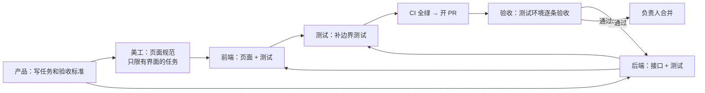

# 开发流程与 6 个 AI 角色

## 角色

| 角色 | 文件 | 负责 | 不能做 |
| --- | --- | --- | --- |
| 产品 | `.claude/agents/product.md` | 把需求拆成任务，写验收标准，维护 roadmap | 写业务代码 |
| 美工 | `.claude/agents/designer.md` | 设计规范、页面布局、样式 | 改后端代码 |
| 后端 | `.claude/agents/backend.md` | 接口定义、数据库、业务逻辑、单元和集成测试 | 改前端、改验收结论 |
| 前端 | `.claude/agents/frontend.md` | 各个后台和官网页面 | 改后端、改设计规范 |
| 测试 | `.claude/agents/tester.md` | 补测试、找边界情况、报缺陷 | 改业务代码 |
| 验收 | `.claude/agents/acceptance.md` | 在测试环境逐条对照验收标准，写验收报告 | 改任何代码 |

写代码的角色不能验收自己的工作；测试和验收角色不能改业务代码。

## 一个任务从开始到验收

## 完成的定义（Definition of Done）

- 验收标准逐条满足，每条都能指到测试或验收报告里的证据。
- `pnpm check` 通过，CI 全绿。
- 没有演示数据、没有密钥原文、没有注释掉的代码。
- 接口变化同步更新 OpenAPI 文档。
- roadmap 已更新，日志已追加。

## 在 claude.ai/code 里怎么开始一个会话

在 claude.ai/code 选择本仓库，发一句话即可，例如：

> 按 CLAUDE.md 和 docs/workflow.md，做 roadmap 里下一个未开始的任务。

需要指定角色时：

> 用 backend 角色做 M0-05，完成后用 tester 角色补测试，再用 acceptance 角色验收。
